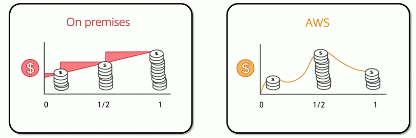
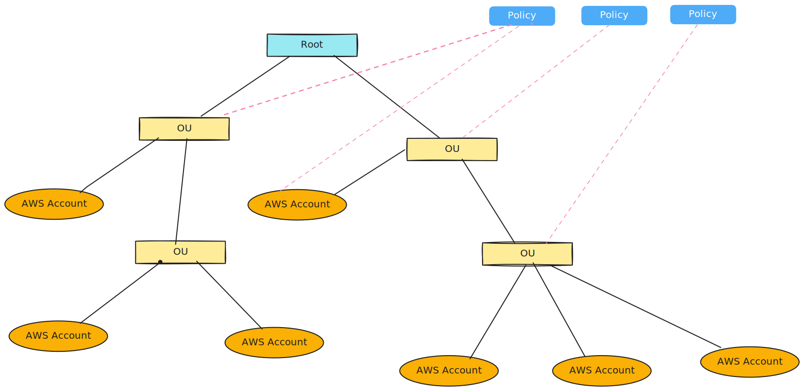

# Cloud Economics And Billing

## 1. Fundamentals of pricing

### AWS pricing model

Three fundamentals drivers of cost with AWS

1. Compute
   - charge per hour/second*
   - varies by instance type
2. Storage
   - Charged typically per GB
3. Data transfer
   - Outbound is aggregated and charged
   - Inbound has no change (with some exceptions)
   - Charged typically per GB

> *Linux only
>
### How do you pay for AWS?

- Pay for what you use
- Pay less when you reserve
- Pay less when you use more and as AWS grows

### Pay for what you use

Pay only for the services that you consume, with no large upfront expenses.



### Pay less by using more

Realize volume-based discounts:  

- Savings as usage increases
- Tiered pricing for services like Amazon Simple Storage Service (Amazon S3), Amazon Elastic Block Store (Amazon EBS), or Amazon Elastic File System (Amazon EFS) -> the more you use, the less you pay per GB
- Multiple storage services deliver lower storage costs based on needs

### Pay even less as AWS grows

As AWS grows:

- AWS focuses on lowering cost of doing business
- This practice results in AWS passing savings from econmies of scale to you
- Since 2006, AWS has lowerd pricing 75 times (as of September 2019)
- Future higher-performing resource replace current resources for no extra change

### Custom Pricing

- Meet varying needs through custom pricing
- Available for high-volume projects with unique requirements

### AWS free tier

Enable you to grain free hands-on experience with the AWS platform, products and services. Free for 1 year  for new customers.  

1. Sign up for an AWS account
2. Learn with 10-minute tutorials
3. start building with AWS

### Services with no charge

- Amazon VPC
- Elastic Beanstalk**
- Auto Scaling**
- AWS CloudFormation**
- AWS Identity and Access Management (IAM)

> **Note: There might be chages associated with other AWS services that are used with these services

## 2. Total Cost of Ownership

### On-premises versus cloud

```txt
+-----------------------------+    +-----------------------------------------+
| Traditional Infrastrucure   |    | AWS Cloud                               |
+-----------------------------+    +-----------------------------------------+
| Equipment                   |    | No upfront expense—pay for what you use |
| Resource and administration | != | Improve time to market and agiliry      |
| Contacts                    |    | Scale up and down                       |
| Cost                        |    | Self-service infrastructure             |
+-----------------------------+    +-----------------------------------------+
```

### What is Total cost of ownership (TCO)?

Total Cost of ownership (TCO) is the financial estimate to help identify direct and indirect costs of a system.  
Why use TCO?

- To compare the costs of running an entire infrastructure environment or specific workload on-premises versus on AWS
- To budget and build the business case for moving to the cloud

### TCO consideration

```txt
+----------------+------------------------------------------------------------------------------------------------------------+----------------------------------------------------------------------------+----------------------------------------+
| Server Costs   | Hardware Server, rack chassis power distribution units (PDU), top-of-rack (TOR) switches (and maintenance) | software: Operating System (OS), virutalization licenses (and maintenance) | Facilities cost, Space, Power, Cooling |
| Storage Costs  | Hardware: Storage disks, storage area network (SAN) or Fibre Channel (FC) switches                         | Storage administartion costs                                               | Facilities cost, Space, Power, Cooling |
| Network Costs  | Network hardware: Local area network (LAN) switches, load balancer bandwitch costs                         | Network administration costs                                               | Facilities cost, Space, Power, Cooling |
| IT Labor Costs | Server administration costs                                                                                                                                                                                                      |
+----------------+------------------------------------------------------------------------------------------------------------+----------------------------------------------------------------------------+----------------------------------------+
```

### On-premises versus all-in-cloud

you could save up to 96 percent a year by moving your infrastructure to AWS. Your 3-year total savings would be $159,913.

### AWS Pricing Calculator

Use the AWS Pricing Calculator to:

- Estimate monthly costs
- Identify opportunities to reduce monthly costs
- Model your solutions before building them
- Explore price points and calculations behind your estimate
- Find the available instance types and contract terms that meet your needs
- Name your estimate and create and name groups of services

### Additional benefit considerations

Hard benefits:

- Reduced spending on compute, storage, networking, security
- Reductions in hardware and software puchases (capex)
- Reductions in operational costs, backup, and disaster recovery
- Reduction in operations personnel
Soft benefits:
- Reuse of service and applications that enable you to define  (and redefine solutions) by using the same cloud service
- Increased developer productivity
- Improved customer satisfaction
- Agile business processes that can quickly respond to new and emerging opportunities
- Increase in global tech

## 3. AWS Organizations

### Introduction to AWS Organizations

### AWS Organizations terminology



### Key Features and benefits

- Policy-based account management
- Group based account management
- Application programming interfaces (APIs) that automate account management
- Consolidated billing

### Security with AWS Organizations

- Control access with AWS identity and Access Management (IAM)
- IAM policies enable you to allow or deny access to AWS services for users, groups, and roles
- Service control policies (SPCs) enable you to allow or deny access to AWS services for individuals or group accounts in an organizational unit (OU)

### Organization setup

1. create organization
2. create organizational units
3. create service control policies
4. test restrictions

### Accessing AWS Organizations

- AWS Management Console
- AWS Command Line Interface (AWS CLI) tools
- Software development kits (SDKs)
- HTTPS Query application programming interfaces (API)

## 4. AWS Billing

### AWS Billing Dashboard

### Tools

- AWS Budgets
- AWS Cost and Usage Report
- AWS Cost Explorer

### Monthly bills

### Cost Explorere

### Forecast and track costs

### Cost and usage reporting

## 5. Technical Support Models

### AWS Support

- Provide unique combination of tools and expertise:
  - AWS support
  - AWS support plans
- Suport is provided for:
  - Experimenting with AWS
  - Production use of AWS
  - Business-critical use of AWS
- Proactive guidance:
  - Techinical Account Manager (TAM)
- Best practices:
  - AWS Trusted Advisor
- Account assistance:
  - AWS Support Concierge

### Support Plans

AWS support offers four support plans:

- Basic support — Resource Center acccess, Service Health Dashboard, product FAQs, discussion forum, and support for health checks
- Developer Support — Support for early development on AWS
- Business Support — Customers that run production workloads
- Enterprise Support — Customers that run business and misson-critical workloads

## 5. Module summary

- Explored the fundamental of AWS pricing
- Reviewed TCO concepts
- Reviewed an AWS Pricing Calculator estimate
- Reviewed the Billing dashboard
- Reviewed Technical Support options and costs

Which AWS service provides infrastructure security optimization recommendations?  

1. AWS Price List Application Programming Interface (API)
2. Reserved Instances
3. AWS Trusted Advisor ✅
4. Amazon Elastic Compute Cloud (Amazon EC2) Spot Fleet
